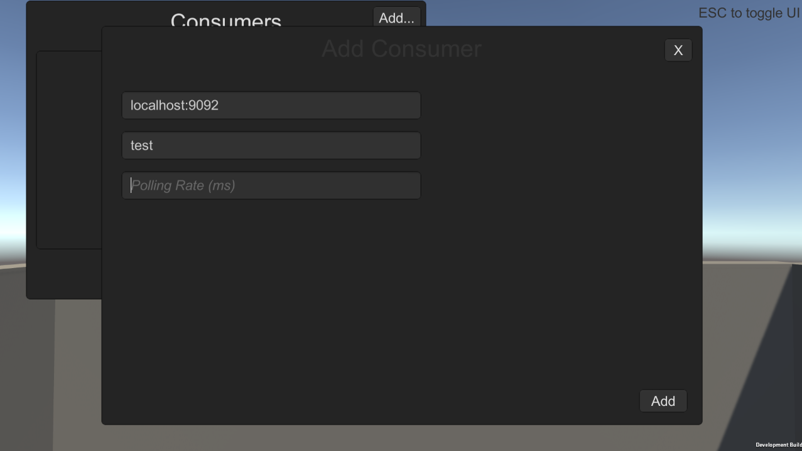
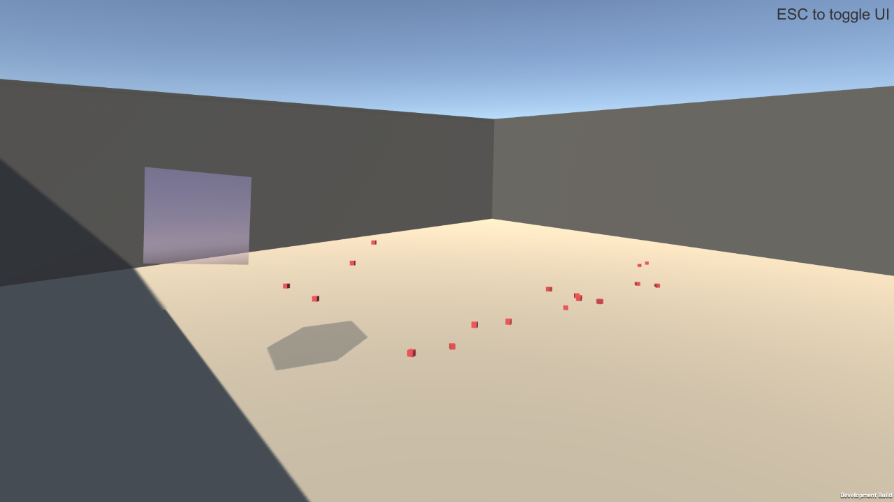

# Kafka Visualizer 3D
A 3D Visualiser for looking at kafka topics, made with Unity.

# Instructions
- Press **P** to toggle freeLook & movement (wasd + q & e)
- Press **ESC** to toggle UI
- Add consumers - provide bootstrap.servers, topic name, polling rate (ms)

### Tips
- Set polling rate to -1 to poll at the next available frame
- Press **ALT + F4** to exit

# TODO
- Add menu option to exit program
- Add options for ssl configuration